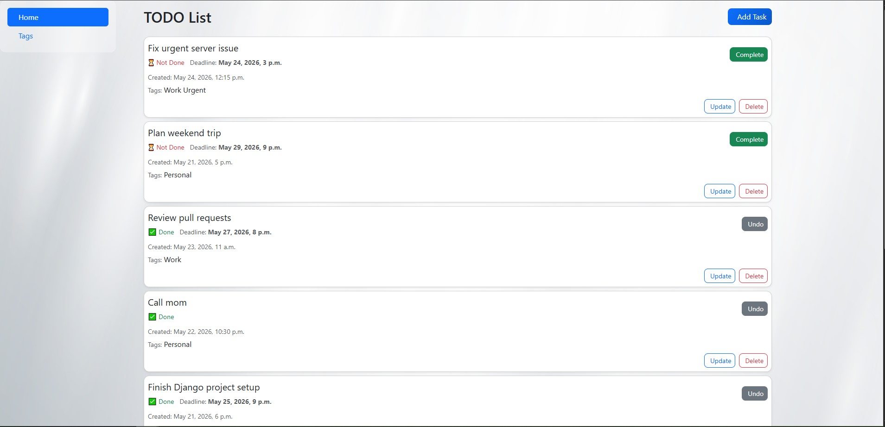
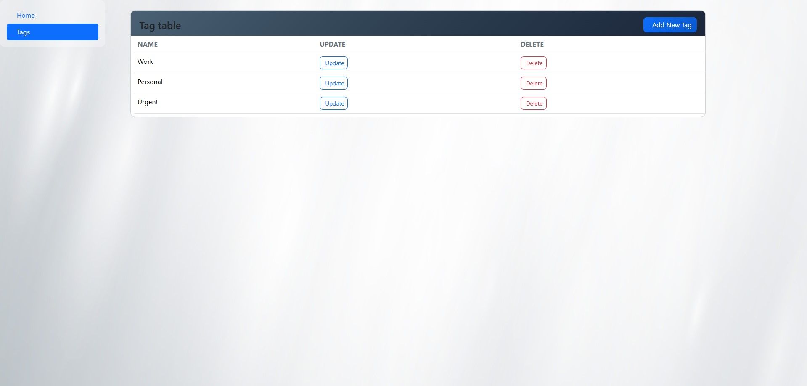

# Todo List

A simple and clean task management web application built with Django.
Supports creating, updating, and deleting tasks with optional deadlines and tags, all wrapped in a responsive Bootstrap UI.

---

## Features

- Create, update, and delete tasks
- Set optional deadlines for tasks
- Mark tasks as completed / undo completion
- Organize tasks with custom tags
- Create, update, and delete tags
- Responsive sidebar navigation
- Glassmorphism-style UI with Bootstrap 5

---

## Tech Stack

- **Backend:** Python, Django 6.0.5
- **Frontend:** Bootstrap 5.3, Font Awesome
- **Database:** SQLite3
- **Other:** django-widget-tweaks 1.5.1

---

## 📦 Installation

### 1. Clone the repository

```bash
git clone https://github.com/AndriiHomeniuk1/todo-list.git
cd todo_list
```

### 2. Create and activate a virtual environment

```bash
python -m venv venv
source venv/bin/activate        # Linux/macOS
venv\Scripts\activate           # Windows
```

### 3. Install dependencies

```bash
pip install -r requirements.txt
```

### 4. Apply migrations

```bash
python manage.py migrate
```

### 5. (Optional) Load sample data

```bash
python manage.py loaddata todo_db_data.json
```

### 6. Run the development server

```bash
python manage.py runserver
```

Open your browser and go to [http://127.0.0.1:8000](http://127.0.0.1:8000)

---

## Screenshots




---

## Author

Built by [Andrii Homeniuk](https://github.com/AndriiHomeniuk1)
